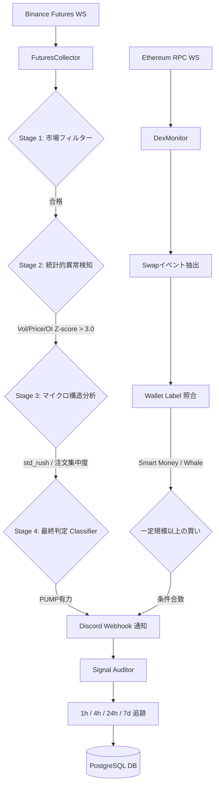

# 🚀 シグナル検知から通知までの全工程 (Project IZANAGI)

IZANAGIボットが、膨大な市場データからどのように「宝のシグナル」を見つけ出し、Discordへ通知するのか、その数学的・技術的なプロセスを詳しく解説します。

---

## 🏗️ 全体フロー図

---

## 🔍 各ステージの詳細 (CEX: Pump Detector)

### **Stage 1: 市場フィルター**
- **目的**: 価値のない「ゴミ銘柄」や、すでに上がりきった銘柄を除外します。
- **基準**: 時価総額、取引高、および過去数時間の値動きをチェックします。

### **Stage 2: 統計的異常検知 (Z-Score)**
- **目的**: 「いつもと違う動き」を数学的に特定します。
- **計算**: 直近100件のデータを平均し、そこからどれだけ「標準偏差」から外れているかを算出します。
- **トリガー**: `Volume Z-score > 3.0`（統計的に上位0.1%の動き）などが検知されると次へ進みます。

### **Stage 3: マイクロ構造分析 (Rush Orders)**
- **目的**: 「誰が買っているか」の"質"を見ます。
- **指標**: `std_rush`（秒間の買い注文の集中度）。
- **ロジック**: 一般投資家のパラパラした買いではなく、クジラやAlgoによる「一瞬の爆発的な買い」を1秒単位でスキャンします。

### **Stage 4: 最終判定 (Classifier)**
- **目的**: 騙し（フェイク）を排除します。
- **ロジック**: Stage 1〜3の全ての数値を XGBoost（機械学習モデル）または高度なルールベースエンジンにかけ、バックテストで得られた「成功パターン（DNA）」と一致するかを判定します。

---

## 💰 On-chain インテリジェンス (DEX: Smart Money)

1.  **リアルタイム・リスニング**: Ethereum上のUniswap V2などで発生する全取引（Swap）を1件残らずキャッチします。
2.  **ラベル照合**: 購入者のアドレスを、ボットが持つデータベース（クジラ、敏腕トレーダー、VC等）と照合します。
3.  **インパクト評価**: $5,000 以上の買い、かつ「Smart Money」によるものであれば、即座に **Cautionレベル** の通知を飛ばします。

---

## 📢 通知とフィードバック

- **通知**: 全ての条件を満たした瞬間、非同期(asyncio)でDiscordへ爆速通知されます。
- **監査**: 通知した後は、`Signal Auditor` がその銘柄をマークし、その後「本当に上がったのか（PnL）」を自動で記録し続けます。これにより、ボットは常に自分の成績を把握しています。

---

> [!TIP]
> **なぜこの4段階が必要なのか？**
> 単なる価格上昇（Stage 2）だけでは、一瞬で終わる「ハメ込み」に巻き込まれます。Stage 3（注文の集中度）とStage 4（成功パターンとの照合）を挟むことで、**「本物のトレンドの初動」** だけを狙い撃ちできるように設計されています。
